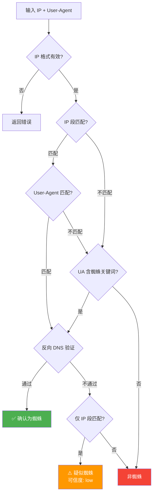

# 🕷️ GSpider IPLookup 蜘蛛 IP 自动识别查询系统

<div align="center">

[](LICENSE)
[](composer.json)
[](https://github.com/KPOPD5/GSpider-IP-Lookup)

</div>

基于 PHP 的搜索引擎蜘蛛（爬虫）IP 自动识别与验证系统，支持**百度、Google、Bing** 等主流搜索引擎蜘蛛的 IP 段匹配、User-Agent 验证和反向 DNS 三重验证，并提供 IP 地理位置查询功能。

作者本人是下图工程师  
  
全部功能和代码由 DeepSeek 官方api接入Visual Studio Code完成。


  
嘻嘻...

## ✨ 前台界面截图

  
  

## ✨ 后台台界面截图

  
  
  
  
  
  
  
  

## ✨ 核心功能

| 功能 | 说明 |
|------|------|
| 🔍 **蜘蛛 IP 识别** | 输入任意 IP，自动判断是否为百度/Google/Bing 等搜索引擎蜘蛛 |
| 🛡️ **三重验证机制** | IP 段匹配 + User-Agent 关键词 + 反向 DNS 解析，确保识别准确率 |
| 🌍 **IP 地理位置查询** | 基于 GeoIP2/DB-IP/IP2Location 数据库，精确到城市级别 |
| 📋 **已确认蜘蛛列表** | 自动记录所有通过验证的蜘蛛 IP，支持按类型/可信度筛选 |
| 📡 **Google 蜘蛛 IP 段库** | 自动同步 Google 官方公布的爬虫 IP 段（含 IPv4/IPv6） |
| ⚙️ **后台管理系统** | SPA 单页管理面板，支持仪表盘、设置、更新、日志、账户管理等 |
| 🔄 **自动更新调度** | 访问时自动触发后台更新（无需配置 Cron），支持动态间隔调整 |
| 🔌 **JSON REST API** | 提供标准化 API 接口，便于第三方系统集成调用 |

## 🛠️ 技术栈

### 后端
- **语言**: PHP >= 7.4
- **数据库**: SQLite 3（WAL 模式，支持并发读写）
- **依赖管理**: Composer
- **核心依赖**:
  - [`geoip2/geoip2`](https://github.com/maxmind/GeoIP2-php) — MaxMind GeoIP2 官方 PHP API
  - [`ip2location/ip2location-php`](https://github.com/ip2location/ip2location-php) — IP2Location PHP SDK
  - `ext-curl` — HTTP 请求（下载数据库/数据源）
  - `ext-sqlite3` — SQLite 数据库驱动
  - `ext-zip` — ZIP 解压（数据库更新）
  - `ext-gmp` — 大整数运算（IP 地址转换）

### 前端
- **纯原生技术栈**（无框架依赖）:
  - HTML5 + CSS3（响应式布局，支持移动端）
  - 原生 JavaScript（ES6+）
  - 深色/浅色主题切换
- **SEO 优化**: Open Graph / Twitter Card / JSON-LD 结构化数据
- **安全**: CSRF Token、XSS 过滤、速率限制

### 地理定位数据库
| 数据库 | 来源 | 用途 |
|--------|------|------|
| GeoLite2-City.mmdb | [MaxMind GeoLite2](https://dev.maxmind.com/geoip/geolite2-free-geolocation-data) | 主要城市级定位 |
| dbip-city-lite.mmdb | [DB-IP Lite](https://db-ip.com/db/download/ip-to-city-lite) | 补充城市数据（覆盖率更高） |
| IP2Location-LITE-DB11.BIN | [IP2Location LITE](https://lite.ip2location.com/) | 第三方备选数据库 |

### 蜘蛛数据源
- **百度蜘蛛**: 手动维护的 IP 段 + 官方 User-Agent 关键词
- **Google 蜘蛛**: 自动同步 [Google 官方 JSON 接口](https://developers.google.cn/crawling/ipranges/)
- **Bing 蜘蛛**: 手动维护的 IP 段（可扩展）

## 📁 项目结构

```
├── index.php                    # 🏠 主页面 — 蜘蛛 IP 查询 UI
├── api.php                      # 🔌 JSON REST API 接口
├── config.php                   # ⚙️ 全局配置文件
├── helpers.php                  # 🧰 工具函数（IP 验证、CSRF、速率限制等）
├── init_db.php                  # 🗄️ 数据库初始化脚本
├── auto_update.php              # 🔄 自动更新调度器
├── SpiderChecker.php            # 🕷️ 蜘蛛检测核心类
├── GeoIPLookup.php              # 🌍 IP 地理位置查询类
├── AdminAuth.php                # 🔐 管理员认证类（bcrypt + session）
├── AdminSettings.php            # 🎛️ 动态设置管理类
├── confirmed.php                # ✅ 已确认蜘蛛 IP 列表页
├── google.php                   # 📡 Google 蜘蛛 IP 段库页面
├── composer.json                # 📦 Composer 依赖配置
├── nginx-admin-route.conf       # 🔀 Nginx 路由规则参考
│
├── admin/                       # 🖥️ 后台管理面板
│   ├── index.php                #    管理仪表盘（SPA）
│   ├── login.php                #    登录页面
│   ├── logout.php               #    登出处理
│   └── ajax.php                 #    后台 AJAX 接口
│
├── guPEid/                      # 🔒 自定义后台入口（路径混淆）
│   ├── index.php                #    路由入口
│   ├── login.php                #    登录页面
│   └── ...
│
├── assets/                      # 🎨 前端静态资源
│   ├── css/
│   │   ├── style.css            #    主页样式
│   │   ├── common.css           #    通用样式
│   │   ├── admin.css            #    后台样式
│   │   ├── confirmed.css        #    蜘蛛列表样式
│   │   └── google.css           #    Google 页面样式
│   └── js/
│       ├── app.js               #    主页交互逻辑
│       ├── admin.js             #    后台交互逻辑
│       └── google.js            #    Google 页面交互
│
├── db/                          # 💾 SQLite 数据库 & 缓存
│   ├── spiders.sqlite           #    主数据库（自动创建）
│   ├── google_spider_cache.json #    Google 蜘蛛缓存
│   └── auto_update_schedule.json#    更新调度状态
│
├── geoip/                       # 🗺️ 地理定位数据库文件
│   ├── GeoLite2-City.mmdb       #    MaxMind GeoLite2
│   ├── dbip-city-lite.mmdb      #    DB-IP Lite
│   └── IP2Location-LITE-DB11.BIN#   IP2Location
│
├── update_google_spiders.php    # 🔄 Google 蜘蛛 IP 段更新脚本
├── update_geoip.php             # 🔄 GeoIP2 数据库更新脚本
├── update_dbip.php              # 🔄 DB-IP Lite 更新脚本
├── update_ip2location.php       # 🔄 IP2Location 更新脚本
│
└── vendor/                      # 📦 Composer 依赖包
    ├── geoip2/geoip2/
    ├── ip2location/ip2location-php/
    ├── maxmind/web-service-common/
    └── maxmind-db/reader/
```

## 🚀 部署指南

### 环境要求

| 组件 | 最低版本 | 说明 |
|------|----------|------|
| PHP | >= 7.4 | 推荐 8.0+ |
| PHP 扩展 | curl, sqlite3, zip, gmp, mbstring | 必须启用 |
| Web 服务器 | Nginx / Apache | 推荐 Nginx |
| Composer | 2.x | PHP 依赖管理 |
| 磁盘空间 | >= 500MB | 用于存储 GeoIP 数据库文件 |

### 1. 克隆/上传项目

```bash
# 将项目文件上传到网站根目录，例如：
cd /www/wwwroot/your-domain.com
```

### 2. 安装 PHP 依赖

```bash
composer install --no-dev --optimize-autoloader
```

### 3. 目录权限设置

```bash
# 确保以下目录可写
chmod -R 755 .
chmod -R 777 db/
chmod -R 777 geoip/

# 建议运行用户与 PHP-FPM 用户一致
chown -R www:www .
```

### 4. 配置 Web 服务器

#### Nginx 配置示例

```nginx
server {
    listen 80;
    server_name your-domain.com;
    root /www/wwwroot/your-domain.com;
    index index.php index.html;

    # 主路由 — 所有请求优先送 index.php
    location / {
        try_files $uri $uri/ /index.php?$query_string;
    }

    # PHP 处理
    location ~ \.php$ {
        fastcgi_pass unix:/tmp/php-cgi.sock;  # 根据实际 PHP-FPM 配置调整
        fastcgi_index index.php;
        fastcgi_param SCRIPT_FILENAME $document_root$fastcgi_script_name;
        include fastcgi_params;
    }

    # 屏蔽直接访问 /admin/ 目录（启用自定义路径后推荐）
    location ~ ^/admin($|/) {
        return 404;
    }

    # 安全：禁止访问敏感文件
    location ~ /\.(admin_path|env|git|htaccess)$ { return 404; }
    location ~ /\. { deny all; }
    location ~ /(db|geoip)/.*\.(sqlite|mmdb|bin|json)$ { deny all; }
}
```

#### Apache 配置（.htaccess）

Apache 用户无需额外配置，项目内置 PHP 路由层自动处理 URL 重写。

### 5. 数据库初始化

首次访问网站首页时，系统会**自动检测并创建 SQLite 数据库**。也可以手动执行：

```bash
php init_db.php
```

> 初始化完成后，请访问 https://你的域名/reset_admin.php 重置获取管理密码，请登录后台立即修改！

### 6. 配置后台管理

**自定义后台路径**（安全混淆，防止恶意扫描）：

1. 在后台 `系统设置` 中设置你的专属后台路径：
2. 系统会自动在项目根目录创建同名文件夹作为后台入口（如示例中的 `guPEid/`）
> 💡 **提示**: 如果忘记管理后台地址，请在网站根目录下查看此文件 `.admin_path` 此文件在你设置专属后台路径后会自动创建

### 7. 下载地理定位数据库

#### 方式一：后台手动下载（推荐）
登录后台 →「更新管理」→ 点击各数据库的「立即更新」按钮。

#### 方式二：命令行手动执行

```bash
# 下载 GeoLite2-City（需配置 MaxMind License Key）
php update_geoip.php

# 下载 DB-IP Lite（免费，无需 Token）
php update_dbip.php

# 下载 IP2Location LITE（需注册获取 Token）
php update_ip2location.php
```

### 8. 设置自动更新（可选）

系统内置**访问触发式自动更新**机制（`auto_update.php`），无需配置 Cron 定时任务：

- 只要有人访问网站，系统会自动检查各数据库是否过期并按需更新
- 更新间隔可在后台「系统设置」中调整
- 默认间隔：Google 蜘蛛 7 天、GeoIP 数据库 30 天

如需使用传统 Cron 方式：

```bash
# 宝塔面板 / Crontab 示例
0 3 * * 0 php /www/wwwroot/your-domain.com/update_google_spiders.php
0 4 1 * * php /www/wwwroot/your-domain.com/update_geoip.php
0 4 15 * * php /www/wwwroot/your-domain.com/update_dbip.php
```

## 🔌 API 接口

### 端点一览

| 端点 | 方法 | 说明 |
|------|------|------|
| `/api.php?action=check&ip=1.2.3.4` | GET | 检查 IP 是否为蜘蛛 |
| `/api.php?action=geo&ip=1.2.3.4` | GET | 查询 IP 地理位置 |
| `/api.php?action=full&ip=1.2.3.4&ua=Baiduspider` | GET | 完整查询（蜘蛛+地理） |
| `/api.php?action=stats` | GET | 获取统计信息 |
| `/api.php?action=ranges` | GET | 获取所有 IP 段 |
| `/api.php?action=recent&limit=20` | GET | 获取最近查询记录 |

### 示例响应

```json
// GET /api.php?action=full&ip=220.181.108.89&ua=Baiduspider
{
  "spider": {
    "ip": "220.181.108.89",
    "is_spider": true,
    "spider_type": "Baiduspider",
    "match_method": "ip_range",
    "matched_range": "220.181.108.0/24",
    "confidence": "high"
  },
  "geo": {
    "country": "中国",
    "country_code": "CN",
    "city": "北京",
    "latitude": 39.9289,
    "longitude": 116.3883
  }
}
```

## 🔒 安全特性

- **bcrypt 密码哈希**: 管理员密码使用 `PASSWORD_BCRYPT` (cost=12) 加密存储
- **CSRF 保护**: 所有 POST 请求验证 CSRF Token
- **XSS 过滤**: `htmlspecialchars()` + ENT_QUOTES 安全输出
- **速率限制**: 基于 Session 的 IP 查询频率限制，防止滥用
- **后台路径混淆**: 支持自定义后台 URL 路径，隐藏真实 `admin/` 目录
- **会话安全**: Session 超时自动失效、登录失败锁定机制
- **CORS 限制**: API 仅允许同源访问，防止跨站请求

## 🎯 蜘蛛验证逻辑



## 🖥️ 后台管理面板

后台采用 **SPA 单页应用** 架构，主要功能模块：

| 模块 | 功能 |
|------|------|
| 📊 仪表盘 | 蜘蛛统计、查询趋势、数据库状态总览 |
| ⚙️ 系统设置 | 动态配置：更新间隔、速率限制、许可证密钥、主题等 |
| 🧬 识别规则 | 反向DNS 自定义识别规则和User-Agent 自定义识别规则管理
| 🔄 更新管理 | 手动/自动更新 GeoIP、蜘蛛 IP 段等数据库 |
| 🕸️ 蜘蛛 IP 管理 | 手动添加/编辑/禁用 IP 段 |
| ✅ 已确认蜘蛛 | 查看所有通过验证的蜘蛛 IP 记录 |
| 📋 查询日志 | 查询历史统计 |
| 🔌 API 管理 | 速率限制、API Key 管理 |
| 👤 账户安全 | 修改密码、查看登录记录 |

## 📄 许可证

本项目基于 **MIT 许可证** 开源 — 详见 [LICENSE](LICENSE) 文件。

使用本项目时，请保留原始版权声明和 GitHub 仓库地址。

## 👨‍💻 作者

**KPOPD5** — [GitHub](https://github.com/KPOPD5)  


## 🤝 贡献

欢迎提交 [Issue](https://github.com/KPOPD5/GSpider-IP-Lookup/issues) 或 [Pull Request](https://github.com/KPOPD5/GSpider-IP-Lookup/pulls)！

---
